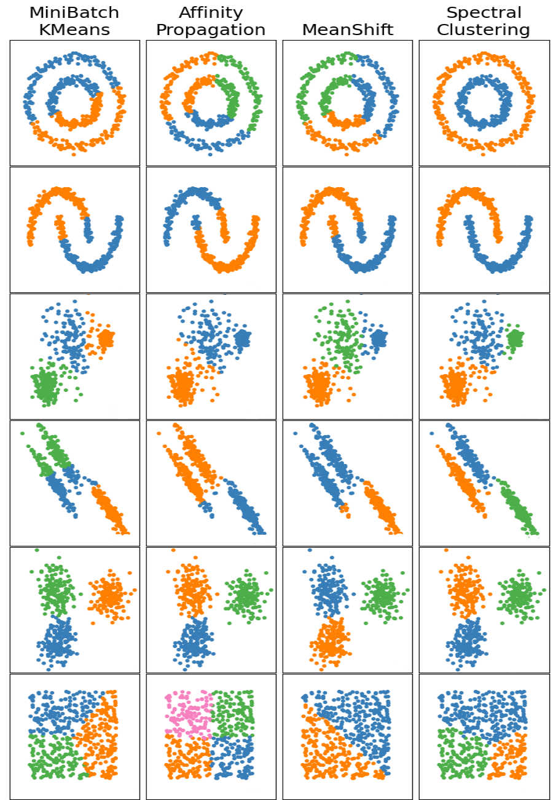

# Info
- visualizing work of clustering algos in C with raylib
- framework to test different algorithms
  - and check their capability to cluster random data
- WIP

# Algorithms
- K-means

# TODO
- implement some more algorithms
  - Affinity Propagation
  - Mean Shift
  - Spectral Clustering

# Overview over Algos

- see references

# References
- https://scikit-learn.org/stable/modules/clustering.html
  - overview of algos
  - source of table
